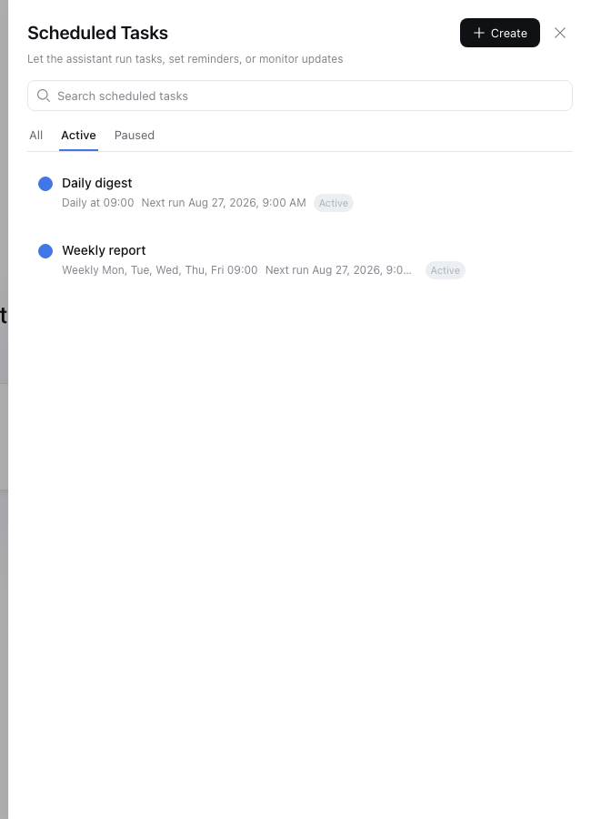
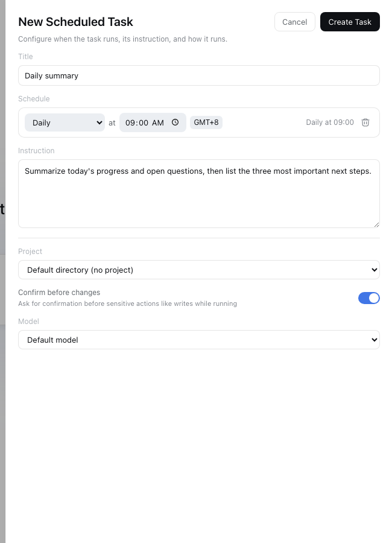

# 定时任务

[DeepSeek Harness](https://github.com/deepseek-ai/deepseek-harness) 的全局调度器：把指令写好一次，助手就会按你的调度自动执行 —— 每小时 / 每天 / 每周 / 每月、指定时刻、或延迟一段时间，每次运行都在独立会话中进行。

[English](README.md)

## 安装

一条命令通过聚合 bundle 拉齐三个半包（host 服务 / remotes 组装 / 浏览器 UI）：

```sh
dsh plugin --profile web add @qihongmu/dsh-plugins-scheduled-task-bundle
```

已在 DeepSeek Harness `dsh-v0.1.2-alpha.2` 上验证（前置要求与兼容性见仓库根 README）。建议 **bundle 与逐个安装二选一，不要混用**；只有需要精细控制时才在源码检出内逐个安装。

## 截图

| 任务列表 | 创建任务 |
| -------- | -------- |
|  |  |

## 打开面板

点击侧边栏的 **Scheduled Tasks** 入口，打开抽屉面板。

## 创建任务

在抽屉中点击 **Create**，填写以下内容：

| 字段 | 说明 |
| ---- | ---- |
| **标题** | 简短名称。留空时使用指令的前 40 个字符。 |
| **调度** | 下方的预设之一。 |
| **指令** | 任务触发时助手要做的事。 |
| **项目** | 任务运行的 workspace/项目目录（可选 —— 未设置时使用默认目录）。 |
| **模型** | 运行任务使用的模型（可选 —— 未设置时使用默认模型）。 |
| **变更前确认** | 开启后，每次运行在写入等敏感操作前会先请求确认。 |

### 调度预设

- **每小时** —— 在指定分钟（0–59）执行。
- **每天** —— 在指定时刻执行。
- **每周** —— 在一周中的一个或多个星期几的指定时刻执行。
- **每月** —— 在每月指定日期执行（没有该日期的月份跳过）。
- **自定义**
  - **指定时刻** —— 在具体日期时间执行（仅一次）。
  - **延迟执行** —— 在 N 秒后执行一次。

时区以 GMT 偏移显示（如 `GMT+8`）。点击可编辑底层的 IANA 地区名（如 `Asia/Shanghai`）。

## 管理任务

- **暂停 / 恢复** —— 停止或继续一个周期任务。
- **编辑** —— 修改标题、调度、项目、模型或确认设置。
- **删除** —— 移除任务及其运行会话。
- **标记已读** —— 点击任务行清除未读标记。
- **搜索 / 筛选** —— 按标题搜索，或按 全部 / 进行中 / 已暂停 筛选。

### 状态指示

- **未读圆点** —— 任务已运行，你尚未查看。
- **逾期** —— 周期任务已过计划时间（将在下一个 tick 触发）。
- **上次运行失败** —— 上次未能启动（悬停查看错误）；任务会自动退避重试。
- **已完成** —— 已触发的一次性任务。

## 备注

- 每个任务都在自己的独立会话中运行，会话标题即任务标题。
- 每个任务在其绑定的**项目**下运行：修改项目会在新 workspace 中开启新会话，切回旧项目时会重新挂载原会话。
- 整点预设遵循所选时区的夏令时规则 —— 被跳过的本地时间（如春季拨快时钟）会顺延到次日。
