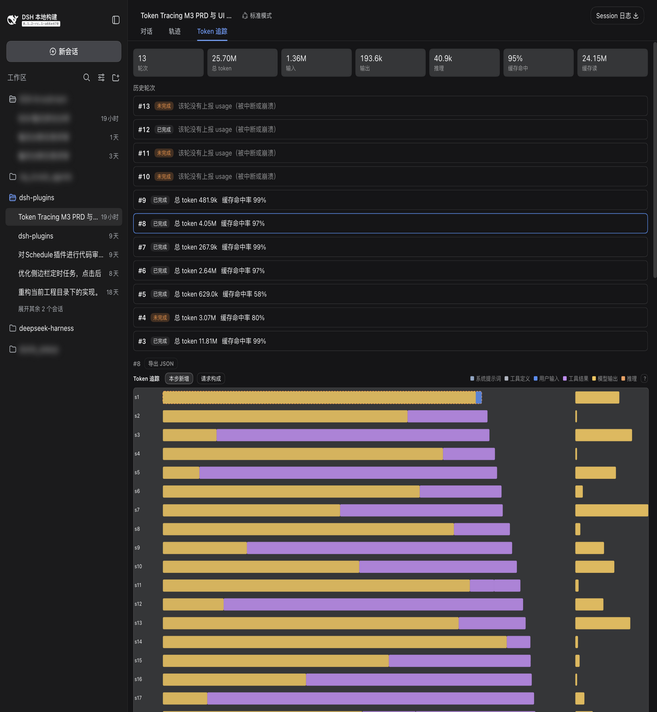
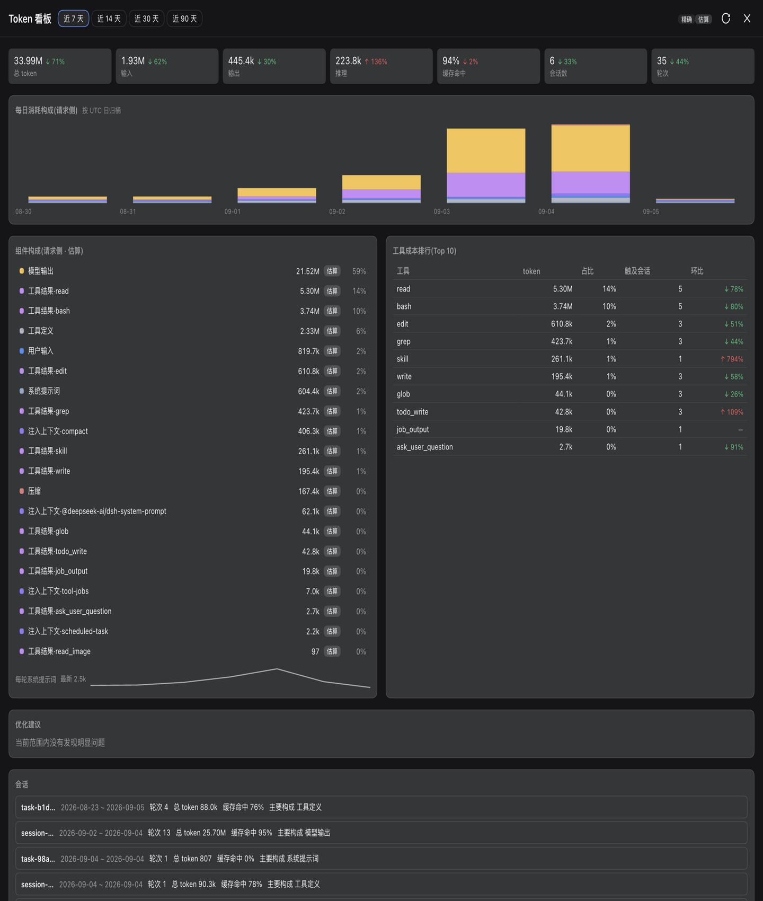

# Token 追踪

[DeepSeek Harness](https://github.com/deepseek-ai/deepseek-harness) 的 token 归因插件：回答「token 花在了哪」——会话中的每次 LLM 调用都被当作一个 span 追踪（用户输入、系统提示词、工具定义、每个工具结果、推理、缓存读/写），对话内有逐轮瀑布图，跨会话有看板与可操作的优化建议。不改动 DSH 本体。

[English](README.md)

## 安装

Token 追踪尚未发布到 npm —— 从已构建的本仓库源码检出安装（构建前置见 [CONTRIBUTING.md](../../CONTRIBUTING.md)；插件 ↔ dsh 兼容表见仓库根 README，已在 `dsh-v0.1.2-rc.1` 上验证）。

```sh
dsh plugin --profile web add ./packages/token-tracing/host ./packages/token-tracing/remotes ./packages/token-tracing/client
```

一条命令把三个半包（host 服务 / remotes 组装 / 浏览器 UI）挂载进 web profile，之后重启 `dsh web`。安装前就存在的会话会在后台自动补算，无需等待数据积累。

## 截图

| 会话内 Token 追踪 tab | 跨会话 Token 看板 |
| --------------------- | ----------------- |
|  |  |

侧边栏中与本会话无关的会话名已做隐私模糊。

## 入口位置

两个入口；均跟随界面语言（English / 简体中文）：

- **Token 追踪 tab** —— 任意会话内，内建「轨迹」tab 旁边。
- **Token 看板** —— 侧边栏底部入口，打开整页跨会话视图。

## Token 追踪 tab

- **汇总条** —— 会话级六个 usage 桶（输入、输出、推理、缓存读、缓存写、总量）加前缀缓存命中率；provider 上报，精确。
- **轮次列表** —— 每轮一行（轮号、状态、总量）。选中轮次打开瀑布图；**导出 JSON** 下载选中轮次的 trace，便于离线分析。
- **瀑布图** —— 每次 LLM 调用一行，含重试与压缩（compaction）：
  - **本步新增**（默认视角）—— 本次调用给上下文**新增**了什么：上一步的输出、每个工具结果、轮内注入。新增总量精确（相邻两次 prompt 总量之差）；其内部按组件的拆分是估算。
  - **请求构成** —— 整个请求：系统提示词、工具定义、会话表面。组件大小为校准估算，且恒与精确的请求总量对得上账。
  - 每个数字都标注**精确**或**估算**。⚡ 标记缓存失效（系统提示词或工具集变更、或缓存读骤降）；压缩行显示摘要替换掉的内容；中断轮如实显示为未完成、缺失的总量不冒充。
  - 点击一行打开明细面板：六桶、组件表、缓存读/写、basis 徽标。

## Token 看板

从侧边栏底部打开的整页视图。范围 chip 选择近 7 / 14 / 30 / 90 天，每项都与等长的上一周期对比：

- **汇总** —— 总量与缓存命中率，带环比增减。
- **每日消耗** —— 按天的堆叠条（按组件着色）；点击某天可过滤会话列表。
- **组件构成** —— 范围内各组件占比，以及每轮平均系统提示词随时间的走势。
- **工具成本排行** —— 哪些工具的结果最烧 token。
- **优化建议** —— 可操作的提示：某工具的结果占据上下文大头、破坏前缀缓存的轮次、系统提示词膨胀、超过 8k token 超长阈值的结果。
- **会话** —— 范围内会话与逐日迷你条；展开可扫描超长工具结果（显式动作、分批执行）并跳转会话。

## 数字的来历

provider 只上报每次调用的聚合 usage——「每个组件精确花了多少」在线路上并不存在。插件分三层归因，绝不让估算冒充精确：

1. **精确** —— provider 上报的每次调用 usage。
2. **差分** —— 一次调用**新增**的总量 = 同一序列内相邻两次 prompt 总量之差，精确；只有它在组件间的拆分按字符占比估算。
3. **校准估算** —— 组件大小按字符密度估算，再统一缩放，保证恒等于精确的请求总量。

混排的数字始终带 basis 徽标，账目永远对得看得见。

## 说明

- **存储** —— 只持久化会话级聚合；轮次明细按需从宿主自己的会话日志重算，不复制会话内容。
- **实时** —— 轮次运行中，更新流式推送进 tab；看板按需读取（手动刷新）。
- 按日归桶使用 UTC 日期。
- 内建 usage 组件（turn usage 面板、stats line、context meter）保持原样；不做金额换算；建议只提示，不自动改动任何配置。
